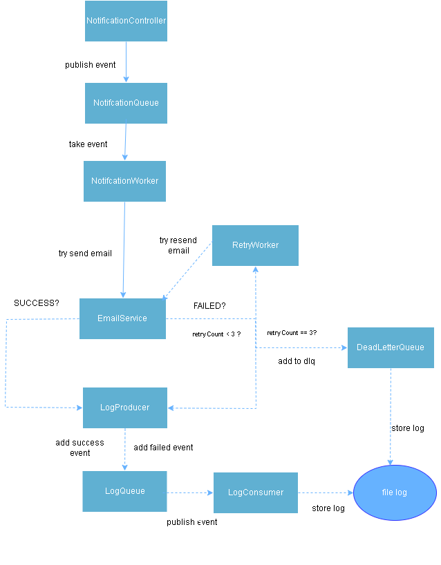

# vkoi-test
- **Phần minimal working cho 3 bài test dược em triển khai ở trong folder Spring boot demo-test.**
## Mô tả
Notification Service là một hệ thống đơn giản minh họa việc gửi thông báo (email) được thiết kế theo mô hình **bất đồng bộ (asynchronous)** và **queue-based**, nhằm xử lý số lượng lớn thông báo với hiệu năng cao, khả năng mở rộng tốt và chịu lỗi hiệu quả.

Hệ thống phù hợp cho các bài toán như:
- Gửi email cập nhật trạng thái đơn hàng
- Gửi thông báo hệ thống
- Xử lý notification với tần suất cao (ví dụ: 10.000 notifications/phút)
---

## Kiến trúc hệ thống

---

## Luồng hoạt động

1. **NotificationController**  
   Nhận request từ client và tạo notification event.  
   Controller chỉ đẩy event vào notification-queue và trả response ngay, không thực hiện xử lý nặng nhằm đảm bảo API phản hồi nhanh.

2. **NotificationQueue**  
   Đóng vai trò là hàng đợi trung gian, tách biệt giữa tầng nhận request và tầng xử lý.  
   Queue cho phép nhiều worker thread cùng lấy job và xử lý song song.

3. **NotificationWorker**  
   Liên tục lắng nghe queue, lấy notification job và gọi `EmailService` để gửi email.  
   Worker chỉ điều phối luồng xử lý, không chứa logic gửi email cụ thể.

4. **EmailService**  
   Thực hiện gửi email .  
   Sau khi gửi, service trả về kết quả thành công hoặc thất bại.
    Việc gửi email thành công hay thất bại em sử dụng Math.random() để minh họa
---

## Retry & Dead Letter Queue (DLQ)

- Khi gửi email thất bại, notification job sẽ được đưa vào **Retry Queue** kèm theo số lần retry.
- **RetryWorker** sẽ thử gửi lại email cho đến khi đạt số lần retry tối đa(hiện tại em để là 3).
- Nếu vẫn thất bại sau số lần retry cho phép, job sẽ được chuyển vào **Dead Letter Queue (DLQ)** để lưu trữ và xử lý sau.

Cơ chế này giúp hệ thống:
- Không mất notification
- Chịu lỗi tốt (fault tolerance)
- Dễ dàng theo dõi và xử lý các trường hợp lỗi

---

## Logging bất đồng bộ

- Kết quả gửi email (thành công hoặc thất bại) được gửi vào **LogProducer**.
- **LogConsumer** xử lý ghi log ra file hoặc database một cách bất đồng bộ.
- Việc tách logging khỏi luồng xử lý chính giúp tránh ảnh hưởng đến hiệu năng của worker.

---

## Ưu điểm của kiến trúc

- API phản hồi nhanh, không bị block bởi IO
- Dễ mở rộng bằng cách tăng số lượng worker thread
- Xử lý song song nhiều notification
- Có cơ chế retry và DLQ để đảm bảo độ tin cậy
- Logging bất đồng bộ, không ảnh hưởng throughput
- Code rõ ràng, dễ bảo trì và mở rộng

---

## Công nghệ & khái niệm sử dụng

- Java / Spring Boot
- Queue-based architecture
- Multi-threading
- Asynchronous processing
- Retry & Dead Letter Queue
- Event-driven logging

---

## Ghi chú
- Đây là phiên bản **đơn giản hóa cho mục đích học tập và bài test**, các queue hiện được cài đặt dưới dạng in-memory.  
- Trong môi trường production, có thể thay thế bằng Kafka, RabbitMQ hoặc các message broker tương đương.